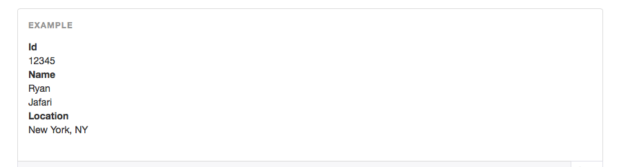
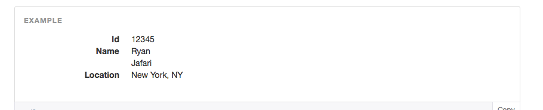

# Description lists

Part of Bootstrap's typography CSS, description lists make perfect sense as an initial example: simple, yet useful. This is great for debugging and displaying information about an application entity such as a `User` on a `show` page, for example.

Let's jump in and see what we're talking about here!

First, let's get familiar with the structure of a description list. They look like this:


Bolded items named "Term" are wrapped in HTML5 **term elements**, specified in HTML with the `<dt>` tag.

"Description" items are wrapped in HTML5 **description elements**, specified in HTML with the `<dd>` tag. So something like the above looks like this in HTML:

```html
<dl>
  <dt>Term</dt>
  <dd>Description</dd>
  <dt>Term</dt>
  <dd>Description</dd>
  <dt>Term</dt>
  <dd>Description</dd>
</dl>
```

Here, the `<dl>` tag defines an HTML5 **description list**. We put our terms (`<dt>`s) and definitions (`<dd>`s) within this wrapper element.

Here's an a real example in action:



Which looks like this in code:

```html
<dl>
  <dt>First Name</dt>
  <dd>Ryan</dd>
  <dt>Last Name</dt>
  <dd>Jafari</dd>
  <dt>Email</dt>
  <dd>ryan@ryanandcarlos.com</dd>
</dl>
```

Can you can see how this would be helpful in printing out the properties of an object?

By the way, Bootstrap gives us the option of changing the orientation of the definition list by applying the `dl-horizontal` class to the `dl` element. That will make the above list look like this:



Terms and their subsequent descriptions are now organized horizontally instead of vertically (the default). Our helpers will definitely be able to handle this option!

---

Now that we've gotten you familiar with the structure of what we want our Rails helpers to output, we can dive into building the actual helpers themselves!

# The `DescriptionListHelper`

## Context

Before we take a look at some helper code, let's set the stage for what we want to implement here by checking out what we'll eventually be able to do in our view:


```erb
<h1>Description Lists</h1>

<%= description_list_for @person, [:first_name, :last_name, :email], true %>
```

Our eventual `description_list_for` helper shown here will allow us to pass in an object (in this case, `@person`), an array of attributes, and whether or not we want the description list to display horizontally (here we do, with `true`).

***PROTIP:*** You might be asking, like we once were:

> Why do I need to pass in a list of attributes? Why can't my helper just look at the object and pump them all out?

Glad you asked, because doing that would be pretty bad. Why? You don't want to blindly iterate over all the object's attributes because that's too heavy-handed (i.e. it will include things that aren't user-friendly such as `created_at` and `updated_at`). Imagine too, that your object has a ton of properties. It makes sense that you'd probably only be interested in a subset of those, which you can specify here as an array of attributes. If you just iterated over all them in your helper code, you wouldn't have that luxury. Nice!

Okay, so how do we build `description_list_for` already? Let's do it!

## The helper

### Starting simple

The end result we've shown you above is pretty fancy, but there's a few things that go into it. We'll go step by step, bringing you from basic architecture (sometimes even dumb and repetitive) to something complex, smart and concise. The benefit of this approach is that it will help you learn how to think about refactoring code into powerful, reusable modules in novel situations.

First, let's take a look at what our most basic implementation of a description list would be.

### Example 0: base case (no helpers)

```erb
<dl class='dl-horizontal'>
   <dt>First Name</dt>
   <dd><%= @person.first_name %></dd>
   <dt>Last Name</dt>
   <dd><%= @person.last_name %></dd>
   <dt>Email</dt>
   <dd><%= @person.email %></dd>
</dl>
```

If you've read and understood the structure of a Bootstrap description list earlier in this chapter, this is probably pretty straightforward to you. We're simply inserting our dynamic data as values instead of static data. 

Now this looks good, but note there's a good deal of repetition going on here with having to write `<dt>` and `<dd>` over and over again in our HTML. Since the spirit of Rails is all about not repeating yourself, we can and should do better! Why not package up those HTML elements into a helper method?

### Example 1: helper for a single pair

```erb
<dl class='dl-horizontal'>
   <%= description_list_pair "First Name", @person.first_name %>
   <%= description_list_pair "Last Name", @person.last_name %>
   <%= description_list_pair "Email", @person.email %>
</dl>
```

Wait! Don't freak out. At a high level, what we're doing here is creating a`<dt>` and `<dd>` pair from the first and second arguments in each `description_list_pair` method call. Let's take a look at what it looks like on a lower level (time for some real code!)

#### The `description_list_pair` helper method

Set yourself up with something like this:

```ruby
# app/helpers/description_list_helper.rb
module DescriptionListHelper
  def description_list_pair(term, description)
    tags = [
      content_tag(:dt, term),
      content_tag(:dd, description.presence || '-')
    ]
    safe_join(tags)
  end
end
```

Simple. We want our two tags `<dt>` and `<dd>` to sit side-by-side within the `<dl>`, with the `term` first and the `description` second. To do this, we're going to put each tag, created by `content_tag` using the type of element (as a symbol) and the value, in order in an array. `safe_join` will take our tags in the `tags` array and squash them into a string, suitable and safe for use in our HTML. Nice! It will look something like this if you were to print the variables out:

```bash
$ tags
=> ['<dt>First Name</dt>', '<dd>Ryan</dd>']

$ safe_join(tags)
=> '<dt>First Name</dt><dd>Ryan</dd>'
```

Why `safe_join`? `safe_join` is a nice way to concatenate tags and different parts together. You could use `+` or `<<` or even `Array.join` but you have to remember to call `html_safe` on it. `safe_join` does this for you automatically.

Not so bad right?

But what's with the `description.presence || '-'`? A `term` (remember, the same as an attribute for our purposes here) will always be present, but a `description`, or value for that attribute, can be missing if our application has never defined it (say the user left their name blank, for example, when filling out a form).  We could have just left it as plain old `content_tag(:dd, description)`, but because of an existing ["bug"](http://ryanjafari.me/blog/2014/04/01/gotcha-with-html-definition-lists-dls-and-bootstrap-3s-dl-horizontal-class/) in Bootstrap, a `<dd>` must always have something inside of it! If `description` turned out to contain nothing, our `<dl>` structure would bug out due to one of its `<dd>` elements not having anything inside of it.

So, `description.presence || '-'` just says "if there is a description present, display it, otherwise put a dash." We could have put a blank (`' '`) or `'not present'` as well, so long as we had something there and not nothing.

---

Whew, okay, cool. Thing is though, we can still do better than this. With each argument to our `description_list_pair` method, we specify the type of information we want twice (`"First Name"` and `@person.first_name`, `"Email"` and `@person.email`, etc.) What if we could infer the name of term (such as `"First Name"`) using the attribute of the record (such as `@person.first_name`)?

### Example 2: helper for a single pair, from a record

Check this out:

```erb
<dl class='dl-horizontal'>
   <%= description_list_pair_for @person, :first_name %>
   <%= description_list_pair_for @person, :last_name %>
   <%= description_list_pair_for @person, :email %>
</dl>
```

Whoa, whoa. What kind of black magic is going on here? True, there's a lot of magic with Rails, but it's not at all nefarious: Rails actually allows us to turn a symbol into a nice label! Let's go for another dip, shall we?

#### The `description_list_pair_for` helper method

```ruby
module DescriptionListHelper
  def description_list_pair(term, description)
    # ...
  end
  
  def description_list_pair_for(record, attribute)
    term        = attribute.to_s.titleize
    description  = record.send(attribute)
  
    description_list_pair(term, description)
  end  
end
``` 

First, we convert `attribute` to a string (since in our example it's a symbol like `:first_name`). That gives us `"first_name"` which we then call `titleize` on to make it pretty, yielding `"First Name"`. This is our description `term`.

Lastly, we get the value of the model's attribute using `record.send(attribute)`. We store that in our `description` variable, which will eventually be used in constructing the description element (`<dd>`) that accompanies our term element (`<dt>`) above.

Then, we simply call `description_list_pair`, the method we built prior.

---

There's still some repetition there with the same method being called three times on the same record, only differing on the attribute used. Whenever you see repeating code like this, it should be flagged for refactoring.

One way we could address this is by creating a loop.

### Example 3a: single pair helper in a loop

```erb
<dl class='dl-horizontal'>
   <% [:first_name, :last_name, :email].each do |attribute| %>
      <%= description_list_pair_for @person, attribute %>
   <% end %>
</dl>
```

Okay, this is really shaping up! There's only one problem with this. With Rails, it's conventional wisdom to abstract any logic code away from the HTML. This generally refers to any code that does something other than spit values out. Here we have the loop code, which doesn't actually render anything onto the screen. For that reason, we want to tuck it away in the helper. Somehow...

What about this?

### Example 3b: the "one-liner"

```erb
<%= description_list_for @person, [:first_name, :last_name, :email], true %>
```

Surely the Rails gods have smiled upon us. This one's only *slightly* more complicated.

#### The `description_list_for` method

Let's take this method one step at a time:

```ruby
module DescriptionListHelper
  def description_list_pair(term, description)
    # ...
  end
  
  def description_list_pair_for(record, attribute)
    # ...
  end
  
  def description_list_for(record, attributes, horizontal = false)
    # TODO
  end
end
```

First, take a look at our method signature `description_list_for(record, attributes, horizontal = false)`. From following along above, you probably already have a good sense of why it looks like this, but as a reminder: 

- The `record` argument is for your model object,
- `attributes` will be an array of symbols that specify attribute or property names (think `:first_name`, `:last_name`),
- and horizontal indicates whether the description list should be styled to display horizontally or not (the default here, as you can see, is set to no, or `false`).

For setup, let's right away get the style class for the description list (remember, the `<dl>` element), shall we?

```ruby
module DescriptionListHelper
  def description_list_pair(term, description)
    # ...
  end
  
  def description_list_pair_for(record, attribute)
    # ...
  end
  
  def description_list_for(record, attributes, horizontal = false)
    style = horizontal ? 'dl-horizontal' : ''
    pairs = attributes.map { |a| description_list_pair_for(record, a) }
    content_tag(:dl, safe_join(pairs), class: style)
  end
end
```

A simple shorthand `if` statement that stores the horizontal style class in our `style` variable for use later if `horizontal` has been set to true. If it was set to false, it just stores a blank (nothing).

With the next line, let's start compiling our description list pairs. We'll do this because once we have all of our pairs, we'll just plop them into a `<dl>` and call it a day.

Here, using the `map` method, we'll iterate over the attributes and use each one along with the model object `record` as arguments to the `description_list_pair_for` method. The result will be a `<dt>` and `<dd>` pair added to our `pairs` array. You already know how `description_list_pair_for` works because we've already built it.

Finally, we add the last line where we create our `<dl>` description list tag with `content_for`. We pump in all of our description list pairs, which by now reside in the `pairs` array, and then `safe_join` them, readying them for HTML rendering. That looks like this:

```bash
$ pairs
=> ['<dt>First Name</dt><dd>Ryan</dd>', '<dt>Last Name</dt><dd>Jafari</dd>', '<dt>Birthdate</dt><dd>2/13/00</dd>']

$ safe_join(pairs)
=> '<dt>First Name</dt><dd>Ryan</dd><dt>Last Name</dt><dd>Jafari</dd><dt>Birthdate</dt><dd>-</dd>'
```

When we call this last `content_for` line, the `safe_join(pairs)` content is wrapped by a `<dl>` with the horizontal class appended if we specified that we wanted a horizontal description list. Let's see what the last line gives us:

```bash
$ content_tag(:dl, safe_join(pairs), class: style)
=> "<dl class='horizontal'><dt>First Name</dt><dd>Ryan</dd><dt>Last Name</dt><dd>Jafari</dd><dt>Birthdate</dt><dd>-</dd></dl>"
```

That right there will be returned to our view and presented to our users in a browser with beautiful Bootstrap styling. We did it all in one line. Amazing. Are you amazed? Just about, we bet.

### Finished product

```ruby
module DescriptionListHelper
  def description_list_pair(term, description)
    tags = [
      content_tag(:dt, term),
      content_tag(:dd, description || '-')
    ]
    safe_join(tags)
  end
  
  def description_list_pair_for(record, attribute)
    term        = attribute.to_s.titleize
    description  = record.send(attribute)
  
    description_list_pair(term, description)
  end 
  
  def description_list_for(record, attributes, horizontal = false)
    style = horizontal ? 'dl-horizontal' : ''
    pairs = attributes.map { |a| description_list_pair_for(record, a) }
    content_tag(:dl, safe_join(pairs), class: style)
  end
end
```

```erb
<h1>Description Lists</h1>

<%= description_list_for @person, [:first_name, :last_name, :email], true %>
```

---

*This is what it's all about people. If stuff like this doesn't get you pumped up, you're in the wrong line of work!*

# Generic vs. project or domain-specific helper methods

It's nearly always prudent to separate project or domain-specific functionality from generic functionality when possible, building the former on top of the latter. This way, you can DRY (don't repeat yourself) up your code by leveraging the generic functionality in other areas of your application, or even other completely different applications you build in the future. Building larger and more complex code from smaller, simpler code is always a good rule of thumb for coding in general, and as you saw, our Rails Bootstrap helpers were no exception!

Let's go back. The `description_list_for` method we wrote is our most project-specific method in our `DescriptionListHelper` module. It is the method we directly use in our views to render beautiful description lists. It is not reusable across projects. What about the `description_list_pair_for` method?

This method is still project-specific. It's in this method that we can make assumptions about how it's being used in our application. What does this mean? It means we can place any kind of domain-specific logic here, if we wanted to. For example, we might decide we want to truncate the property value that will be inserted into a `<dd>`, based on some if/else logic that's specific to our "Widgets" application. For demo purposes here, we illustrate the project-specific nature in a simpler way, with a simple `titleize`.

It follows then that the `description_list_pair_for` method is *not* reusable across projects. That's okay though, because not all methods should be.

The `description_list_pair` method *is* generic. Why? It takes two string values and puts them into the standard `<dl>` structure. It doesn't attempt to do anything fancy or project-specific, and because a `<dl>` construct is HTML, it can easily be used across many different (web) projects (even those not using Bootstrap!) and probably belongs in the lib folder.

Remember, you can keep using the smaller pieces (here the generic `description_list_pair` method) to build bigger, more comprehensive helpers. The modularity of the smaller helpers will ensure that you won't end up with a giant brittle helper that can never be changed.

# Further study

A single term (`<dt>`) can have multiple descriptions (`<dd>`s). Like so:


Which in code looks like:

```html
<dl>
  <dt>Id</dt>
  <dd>12345</dd>
  <dt>Name</dt>
  <dd>Ryan</dd>
  <dd>Jafari</dd>
  <dt>Location</dt>
  <dd>New York, NY</dd>
</dl>
```

How might you extend the helper and its methods to support that?