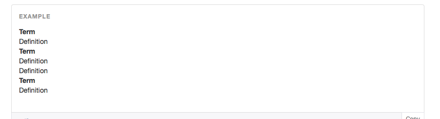

## Description lists

Part of Bootstrap's typography CSS, description lists make perfect sense as an initial example: simple, yet useful, especially when we want to print out information about an object. This is great for debugging and showing the user information about an application entity, for example, on a `show` page.

Let's jump in and see just what we're talking about here!

First, let's get familiar with the structure of a description list. If you already comfortable with Bootstrap, you may want to [skip ahead](#something). In Bootstrap, they look like this:



Bolded items named "Term" are wrapped in HTML5 **term elements**, specified in HTML with the `<dt>` tag.

"Description" items are wrapped in HTML5 **description elements**, specified in HTML with the `<dd>` tag. So something like the above looks like this in HTML:

```html
<dl>
  <dt>Term</dt>
  <dd>Description</dd>
  <dt>Term</dt>
  <dd>Description</dd>
  <dd>Description</dd>
  <dt>Term</dt>
  <dd>Description</dd>
</dl>
```

Here, the `<dl>` tag defines an HTML5 **description list**. We put our terms (`<dt>`s) and definitions (`<dd>`s) within this wrapper element.

Here's an a real example in action:


Which looks like this in code:

```html
<dl>
  <dt>Id</dt>
  <dd>12345</dd>
  <dt>Name</dt>
  <dd>Ryan</dd>
  <dd>Jafari</dd>
  <dt>Location</dt>
  <dd>New York, NY</dd>
</dl>
```

Can you can see how this would be helpful in printing out the properties of an object?

By the way, Bootstrap gives us the option of changing the orientation of the definition list by applying the `dl-horizontal` class to the `dl` element. That will make the above list look like this:


Terms and their subsequent descriptions are now organized horizontally instead of vertically (the default). Our helpers will definitely be able to handle this option!

---

Now that we've gotten you familiar with the structure of what we want our Rails helpers to output, we can dive into building the actual helpers themselves!
